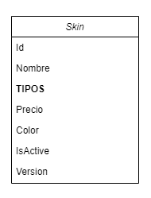
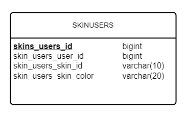

# Skins-API-Backend
This is a basic API that allow users to get, buy, modify and delete skins for a hypothetical
 application.

## Architecture
This project is written in Java 17 and Spring Boot 3.1.5, and it is connected to an external online MySQL database service in order to save the data for skins bought for the different users.
Also, this API reads a json configuration file inside the project, which contains the skins data provided to the users by their requests.

## Quick Start - Execution
In order to execute this API, download the repository and open the project with your favorite Java IDE. Then let the IDE update all dependencies. 

When all is updated, you will need to provide an accessible MySQL database squema with a valid user and password. The user has to have permission to execute DDL sequences into the database, because the API will create the table and populate the database with basic information.

Follow, open the file ***"src/main/resources/connection.properties"*** and fulfil the following:

- **MySQL.database.host**= database host name
- **MySQL.database.squema**= database squema
- **MySQL.database.username**= user database
- **MySQL.database.password**= password for the user

-----

## Data Models Used
The project was constructed using two different data structures, the "Skin" model and the "User Settings" model.

### The Skin Model
The Skin model is intended for represent each one of the skins created to be served for this API.
The attributes represented in this data structure are:

- **skin id:** represents a unique id for each skin. 
- **name**: The name to represent the skin. 
- **type**: attribute for different kind of skins.
- **price**: the price of the current skin.
- **color**: the default skin color which is defined by the author. 
- **active**: means if the current skin is disabled or not for his use. For example, this characteristic could be use in case a skin is not available for sale yet.
- **skinversion**: shows the current version of the skin.

 
 
### The Skin-User Model

The model used for save the bought skins by a certain user is based on a MySQL database schema. Basically it use only one table to store the data needed. The structure of this table is compound for the follow columns:
- **skins_users_id**: Primary key of type biginteger.
- **skins_users_user_id**: contains the id of each user sent by the external application.
- **skins_users_skin_id**: This column keeps the skin id, in order to match with the previous column a skin bought for a specific user.
- **skins_users_skin_color**: here is saved the color of the skin, the original one or the one customized by the user.

